环境：
* blender2.8
* godot3.2

mixamo是adobe推出的3D动画在线服务平台，它提供了很多免费的角色和动画，并且可以自动绑骨。用户可以上传自己的模型，然后简单的选中关节后，就可以将资源库里的所有动作应用到我们的模型上面。

接下来演示如何将mixamo上的模型动画导入到godot中。

首先，进入官网https://www.mixamo.com/。注册登录后，就来到了这个页面：

---
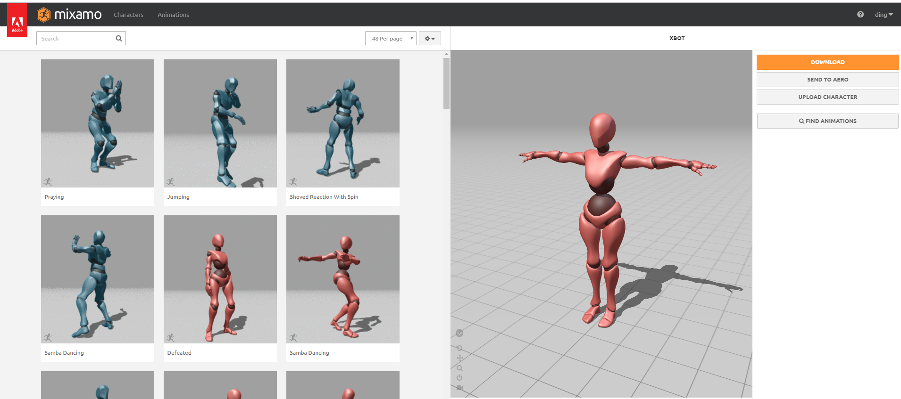

### 下载模型和动画

这里就选用默认的模型为例：

第一步先不需要选动作，直接将这个T-pose下载下来：

---
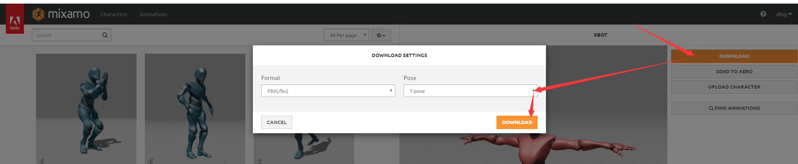

然后选中一个动画，预览区会出现绑定该动画后的模型动画：

---
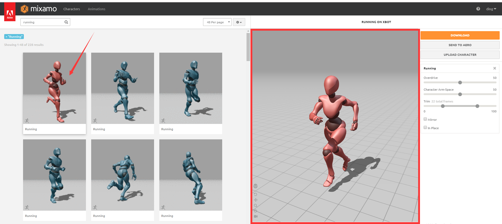

点击下载，选择without skin选项，只下载骨骼动画，不下载模型。

---
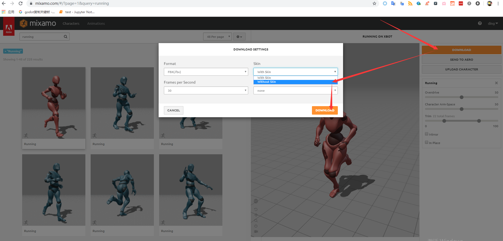

按照上面的步骤再下载一个动画，这里我下载了defeaded。

这样，我们就有了三个文件：

---
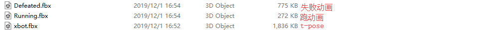

### 将模型和骨骼动画导入blender

接下来，打开blender，新建一个空工程，然后导入xbot.fbx:

---
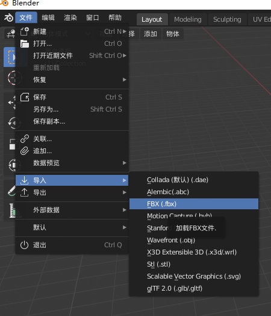

---
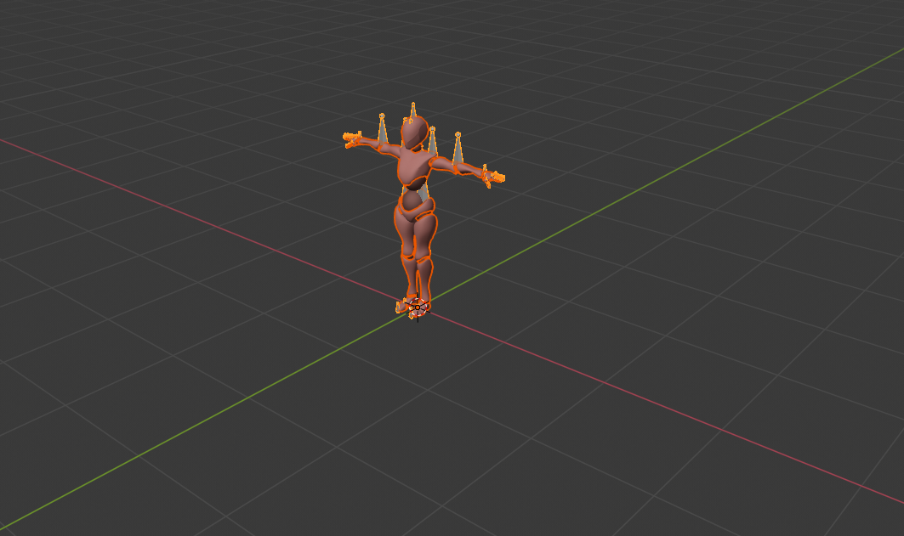

继续导入一个动画文件：

---
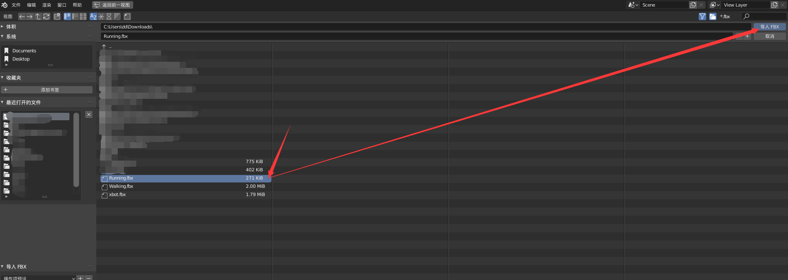

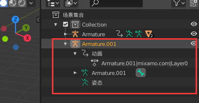

现在，切换到动画摄影表：

---
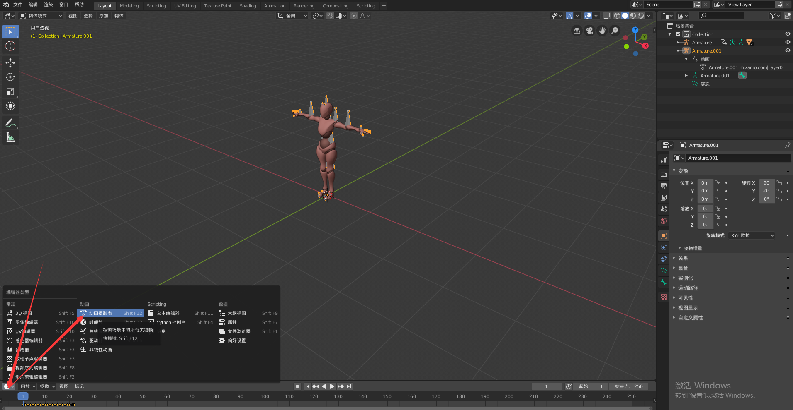

选择动作编辑器（action editor）

---
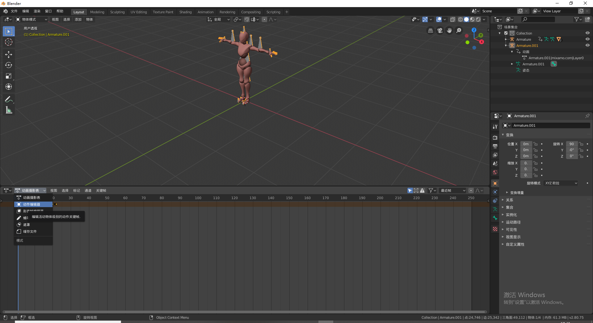

先选中t-pose模型，再选中“跑”动画。

---
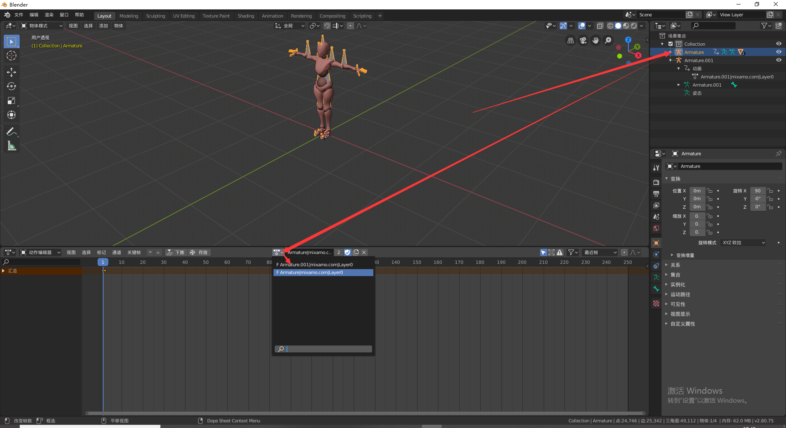

然后空格播放，这样角色就跑起来了：

---

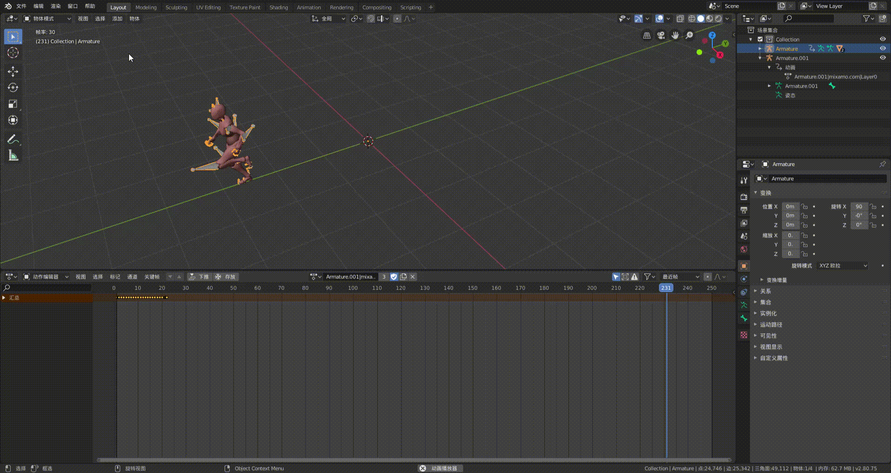

按照同样的方法，将defeated动画导入blender。

然后将工程导出为escn格式：

---
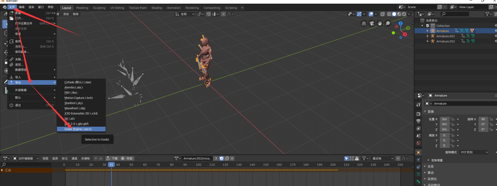

### 导入godot

选择刚才导出的escn文件，打开：
---
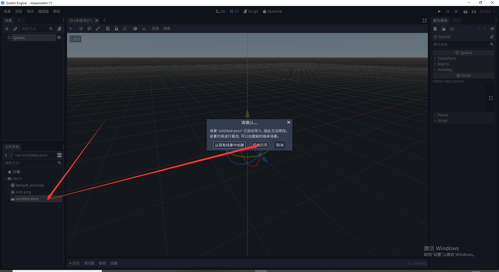

---
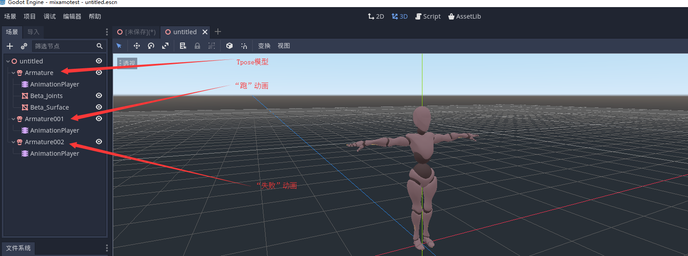

现在我们把两个谷歌动画下的AnimationPlayer都移动到Tpose下：

---
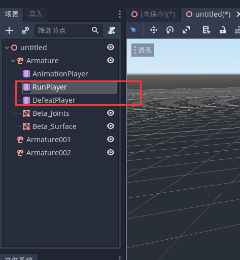

现在已经可以看到动画了：

---
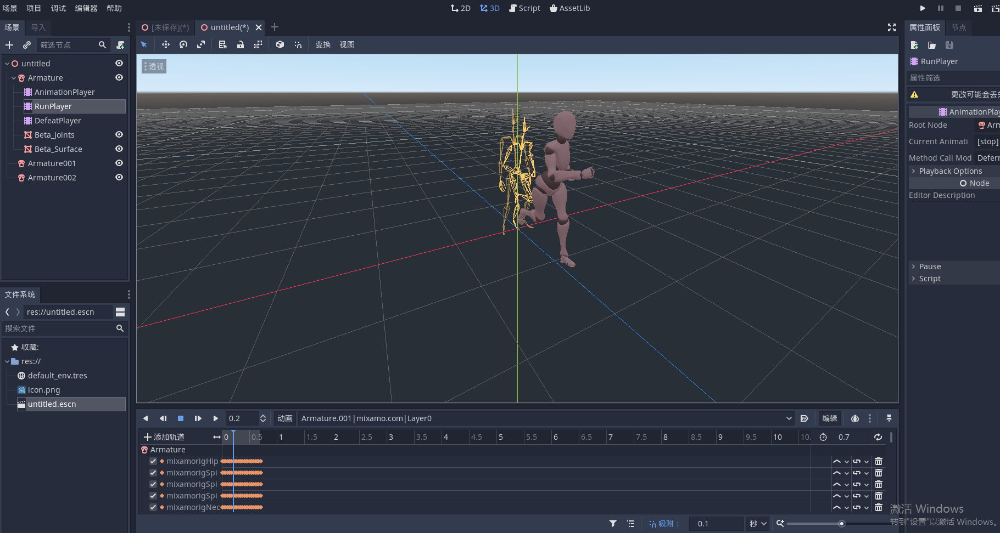

现在每一个animationplayer中只有一个动画，完全可以把他们放到一个player中，所以最后一步将不同animationplayer中的动画复制粘贴到一个里面即可。

---
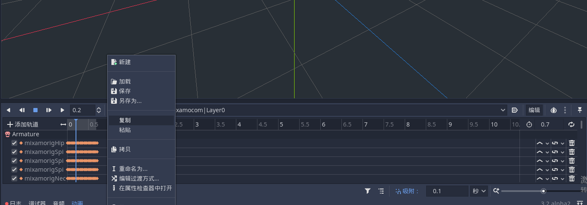
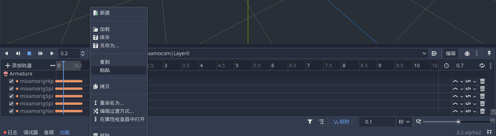
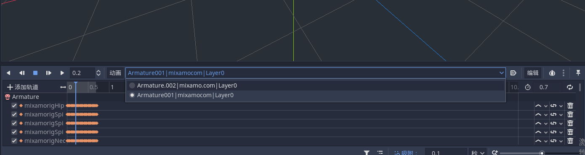